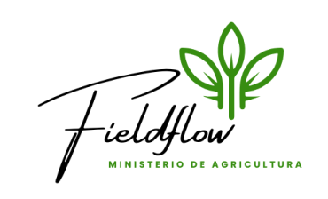
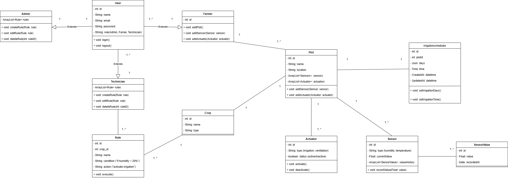
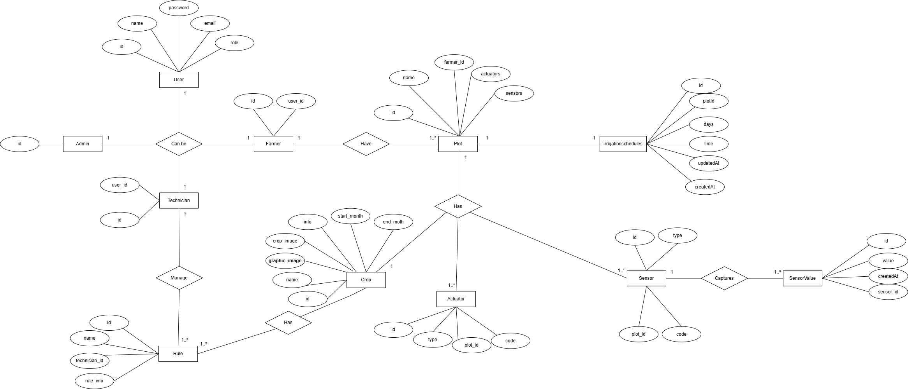
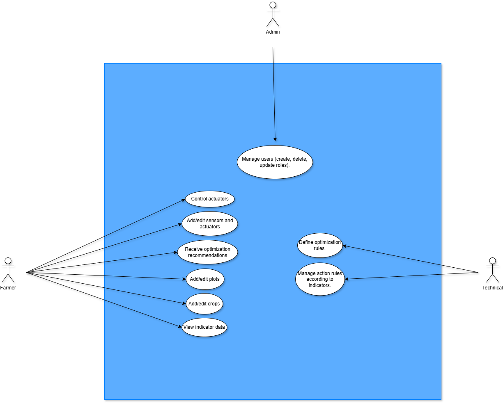
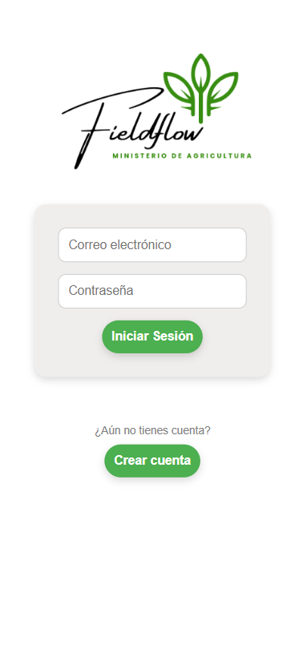
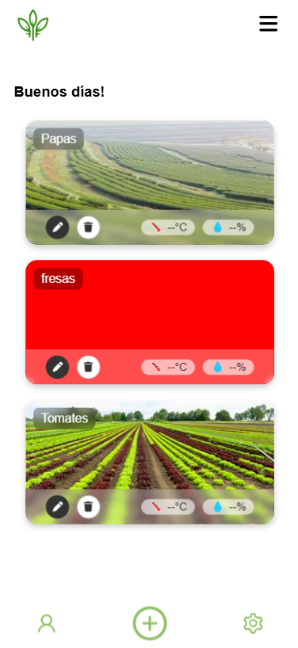
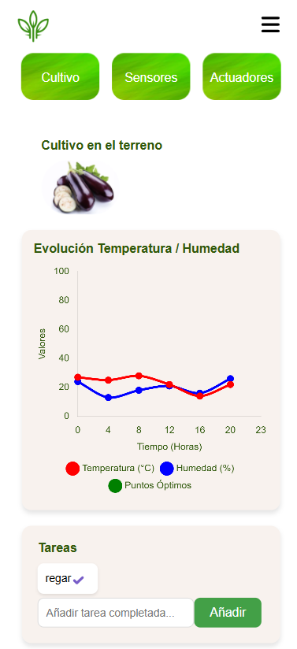
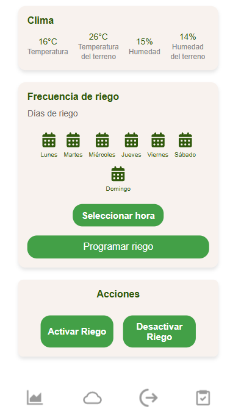

#  AgroSOS

<div align="center">
  <a href="https://github.com/Aiimaar/AgroSOS">
    
  </a>
  <h2>AgroSOS</h2>
  <p>
    🌱 A comprehensive agricultural data management system<br>
    Empowering precision agriculture with technology.
  </p>
  <p>
    <a href="#about-the-project"><strong>Explore the project »</strong></a>
  </p>
</div>


---

## 📖 About The Project

AgroSOS is designed to enhance agricultural productivity by managing data collected from sensors placed on agricultural fields. The system enables farmers, technicians, and administrators to collaborate effectively, using technology to monitor and optimize crop yields.

### Key Features

- 📊 **Data Visualization**: Graphs showcasing key indicators of crop health and field conditions.
- 🤖 **Automation**: Recommendations and actions based on sensor data to optimize crop performance.

<p align="right">(<a href="#readme-top">back to top</a>)</p>

---

### 🔐 Authentication and Roles

AgroSOS implements both basic and token-based authentication to ensure secure access. The roles used in the system are as follows:

- **Admin**: Manages users and configurations.
- **Farmers**: Registers and manages fields, sensors, and crops, while accessing their specific data.
- **Technicians**: Configures automated rules based on sensor data.

This structure emphasizes the distinction between authentication (verifying identity) and authorization (assigning permissions). For example, access to certain frontend routes is restricted based on authentication state, verified by checking tokens stored locally.

<p align="right">(<a href="#readme-top">back to top</a>)</p>

---

## 🛠️ Technologies Used

- **Frontend**: ReactJS
- **Backend**: Node.js + Express
- **Database**: MySQL
- **ORM**: Sequelize

<p align="right">(<a href="#readme-top">back to top</a>)</p>

---

## 👥 Team Description

### Students and Roles
- **2nd DAW-Evening**: Development of the backend and frontend for the system.

### Coordination
- **Project Coordinator**: Miguel Ángel Figueroa García
- **Product Owner**: Miguel Ángel (responsible for clarifying project requirements).

<p align="right">(<a href="#readme-top">back to top</a>)</p>

---

## 🔄 Database Queries

This section includes the queries and database setup for the project.

### Database Setup

Before running the application, ensure you have the MySQL database set up correctly. You can use the following steps to configure the database:

1. **Create the database**:

   Log into MySQL and create the database for the project:

   ```sql
   CREATE DATABASE agrosos;
   ```
2. Query with the basic structure of the database.

```sql
   Query con la base de datos
   ```
---

### 📑 Data Access and Relationships

AgroSOS ensures consistency between the database schema and its relationships through:
 1. A **relationship diagram** that visualizes the relationships between the entities.
    
 2. **CRUD operations** for managing data across multiple related entities.

  <div style="display: flex; gap: 10px;">
    
    
    
  </div>

Data filtering is performed in the backend to optimize performance and ensure data integrity.

<p align="right">(<a href="#readme-top">back to top</a>)</p>

---

## 🚀 How To Get Started

1. Clone the repository:
   ```bash
   git clone https://github.com/Aiimaar/AgroSOS.git
2. Navigate to the project directory:
   ```bash
   cd AgroSOS/agrosos
   ```
3. Install dependencies for both backend and frontend:
   ```bash
   cd backend && npm install
   ```
   ```bash
   cd ../frontend && npm install
   ```
4. Run the development server:
   ```bash
   cd backend && node express.js
   ```
5. Run the frontend
   ```bash
   cd frontend && npm run dev
   ```
   
---

## 📦 System Requirements

Make sure to have the following programs installed before getting started:

- **Node.js** (version = v20.18.0)
- **MySQL** (version = 8.0.38)
- **NPM** (version = 10.8.2)

---

## 📸 Screenshots

Here are some screenshots of the application:

<div style="display: flex; gap: 10px;">
  
  
  
  
</div>

---
### 🖥️ RESTful API and CRUD Operations

The project adheres to RESTful principles for communication between frontend and backend. API endpoints are documented and tested using Postman. Find the complete collection [here](https://documenter.getpostman.com/view/38432154/2sAYHwKQaD).

<p align="right">(<a href="#readme-top">back to top</a>)</p>

---

### 📂 Directory Structure

#### Backend
The backend follows a modular structure:
- `controllers/`: Handles business logic.
- `middleware/`: Contains middleware functions for request processing.
- `models/`: Defines database models using Sequelize.
- `routes/`: Contains route definitions for API endpoints.
- `uploads/`: Directory for handling file uploads.
- `db.js`: Database connection configuration.
- `express.js`: Main server setup and configuration.

#### Frontend
The frontend is organized to separate concerns effectively:
- `public/`: Contains static assets
- `src/`:
  - `assets/`: Images, styles, and other assets.
  - `components/`: Reusable React components.
  - `context/`: React context for managing global state.
  - `pages/`: Defines the main pages for the application.
  - `App.jsx`: Main application component.
  - `main.jsx`: Entry point for the React app.
  - `index.css`: Global styles.

This structure ensures clarity, maintainability, and scalability for both backend and frontend development.

<p align="right">(<a href="#readme-top">back to top</a>)</p>

---

### 🌐 System Design Comparison

The project adopts the **Enfoque 1** architecture, utilizing separate frontend and backend technologies. In contrast, **Enfoque 2** integrates server-side rendering tools like Laravel Blade. The decision to use Enfoque 1 enables:

- Enhanced scalability.
- Clearer separation of concerns.

Technologies:
- Backend: Node.js
- Frontend: ReactJS

An example comparison:

| Feature                | Enfoque 1 (AgroSOS)           | Enfoque 2                |
|------------------------|-------------------------------|--------------------------|
| Communication          | RESTful APIs                 | Server-side rendering    |
| Technologies           | Node.js, ReactJS             | Laravel Blade            |
| Flexibility            | High                         | Moderate                 |

<p align="right">(<a href="#readme-top">back to top</a>)</p>

---

## 📝 License

This project is licensed under the MIT License. See the [LICENSE](LICENSE) file for more details.

---

## 🤝 How to Contribute

Thank you for your interest in contributing to AgroSOS! Here are some guidelines to follow:

1. Fork the repository
2. Create a new branch for your feature (`git checkout -b feature/my-feature`)
3. Make your changes
4. Run tests to ensure everything works correctly
5. Commit your changes (`git commit -m 'Add my feature'`)
6. Push your branch (`git push origin feature/my-feature`)
7. Open a pull request

Before submitting your PR, make sure to follow these conventions:

- Use clear branch and commit message naming conventions.
- Keep the code clean and well-documented.
- If possible, add unit tests for your functionality.

---
